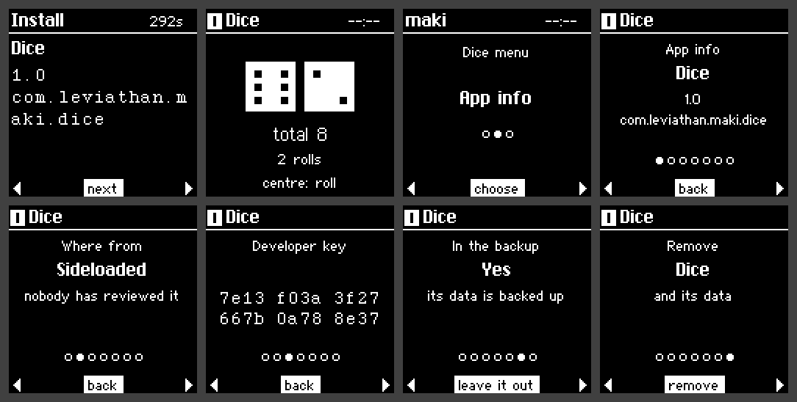

# Apps and the store

Anyone can write an app for maki and sideload it without flashing firmware, or send it to the maki
store. A `.maki` file is one app: its code (WebAssembly, or native code the kernel confines), a
manifest, a 64×64 icon and its developer's signature.

## Installing an app

In maki desktop's **Apps** page, pick an app from the store and choose **Install**. maki goes
through it on its own screen, the way it goes through a transaction: the name and version, where
it's from (the store, or sideloaded), the developer's key, each permission it wants in the
developer's own words, and what it needs of maki (storage, memory, whether its data goes in
backups). It installs only when you say so.

An update needs the same app, signed with the same developer key, and a higher version; maki asks
again only for permissions the app didn't have.

## The store

The store is a Git repository ([maki-apps](https://github.com/KaraZajac/maki-apps)), as Flipper's
catalogue is: each app's signed bundle and the commit of public source it's built from. Its CI
rebuilds every app it's sent, and every app each week, and checks the bundle byte for byte, so
what was reviewed is what gets stamped. It follows The Update Framework's pattern: offline root
keys (any two of three), a short-lived key that stamps each reviewed build, and a revocation list
maki checks against verified time. A store app carries two signatures, its developer's and the
store's, so no single stolen key can push an update.

The store runs on development keys for now, until the real ones are made offline. See every app on
the [apps page](https://maki.netslum.io/apps/).

## Permissions

An app gets the screen below maki's bar, the buttons, its own storage, the time and random numbers.
Anything more is a permission, which it asks for, with a reason, before it installs:

| Permission | What it lets an app do |
|---|---|
| `ask` | Put a question on maki's own screen, naming the app, even while it isn't open; or pages before it, on maki's review screen |
| `keys` | Keys of its own from your recovery phrase: the same on a restored maki, different for every app. maki holds them and signs for it (Ed25519, BIP340 Schnorr, X25519) |
| `link` | Messages with software on your computer, through maki desktop, which can wake the app to answer |
| `keyboard` | Type into your computer as a USB keyboard, only while it's in front, with "typing" in maki's bar. The strongest warning at install: it could type commands |
| `camera` | Read QR codes, through maki's own scanner |
| `motion` | The accelerometer. Warned at install: it can pick up typing nearby |
| `wallet` | Keys from your recovery phrase at the standard paths, for the accounts its manifest names and no others; it signs only what you've gone through on maki's review screen |

No permission gives an app the recovery phrase, the vault's logins, codes or passkeys, another
app's keys or storage, the PIN, raw hardware, or a way to press maki's buttons.

## While an app is open

The top line of the screen is maki's: the app's name, a mark on a sideloaded app that never goes
away, "typing" while it types, and the clock. No app can draw over it, so none can pass for maki's
own screens, and maki never asks for the PIN while an app is open.

WebAssembly apps run in wasmi, an interpreter written in Rust, with a cap on memory and fuel
metering, so an app that stops yielding is stopped rather than freezing maki. A native app is
machine code in a process of its own, which maki's kernel confines before any of it runs: it
reaches only maki's app service, the timer and the log.

## App info, and removing an app

Open an app's menu (both buttons) for **App info**: what it is, where it's from, its developer's
key, whether its data is in maki's backups (and "leave it out"), and **Remove**, which takes the app
and its data away once you confirm on maki.

## Sideloading, and writing your own

`maki install app.maki` (from the SDK) sends a file of your own through maki desktop; maki marks it
as sideloaded for as long as it's installed. [Writing apps](https://github.com/KaraZajac/maki-firmware/blob/maki/sdk/README.md)
is the SDK's guide.
