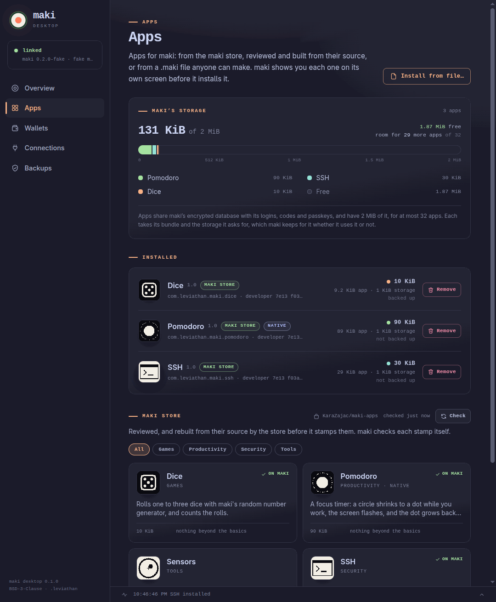

# maki desktop

maki desktop is a small app in the tray, and the only thing on your computer that talks to maki.
It keeps the link and the time, keeps encrypted backups, installs apps, and is a wallet, the SSH
agent, and the go-between for the browser extension, gpg, age, minisign, sudo and Nostr apps. It
holds no keys: whatever it asks maki for, maki shows you first.



## Install it

On Linux, download the AppImage from the [download page](https://maki.netslum.io/download/), make
it executable and run it:

```sh
chmod +x maki-*.AppImage
./maki-*.AppImage
```

It opens a window and puts maki in the tray. Closing the window keeps it running in the tray, so
the link stays up; **Start at login** (in the window, or the tray's menu) starts it hidden each
time you log in.

To reach maki's serial port, your user needs to be in the group that owns it (`dialout` on Fedora
and Debian, `uucp` on Arch): `sudo usermod -aG dialout $USER`, then log out and back in.

## Linking

Plug maki in and unlock it with its PIN. maki desktop finds it by itself: any port with maki's USB
IDs gets one short, harmless hello, and a device that doesn't answer (a stock DC34 badge shares
the IDs) is left alone. Once linked, maki shows a dot in its bar, and maki desktop shows maki's
name. A heartbeat every ten seconds keeps the link; after 25 seconds of silence, maki drops it.
Unplug maki and plug it back in, and maki desktop links again by itself once maki has started
(about 20 seconds): a port that doesn't answer yet is tried again for a minute.

## The time

The badge has no battery and forgets the time when it's unplugged. When it links, and every six
hours after, maki builds Roughtime requests; maki desktop carries them to three public servers,
and maki checks the signed answers itself: it needs two that agree. If Roughtime can't be reached,
maki takes the computer's clock, but marks it unverified and never uses it to overwrite a verified
time. One-time codes wait for a verified clock, so a computer that lies about the time can't
collect them for later.

## Backups

On linking, every hour, and soon after a login is saved, maki hands over its logins, codes and
passkeys, encrypted with a key from its recovery phrase. maki desktop keeps them in its own folder;
it can't read them. **Restore to maki** sends the latest back, and maki asks before adding
anything. The PIN is never part of a backup: a backup file is exactly what someone would try PINs
against.

## Apps

The **Apps** page shows maki's room for apps, what's installed, and the [maki store](apps.md)'s
apps by category. Installing one sends it to maki, which goes through it on its own screen (what it
is, where it's from, who signed it and each permission it wants) and installs it once you say so.
`maki install app.maki`, from the SDK, installs a file of your own the same way.

## Updates

The Overview's **Updates** card says whether there's newer firmware for maki, a newer maki
desktop, or newer versions of maki's apps. Each release comes from the maki store's index, which
the store signs: maki desktop takes a file only if it's the size and SHA-256 the store signed
for.

- **Update maki** fetches the new firmware, and maki asks you on its screen whether to restart
  for it. Say yes, and maki restarts into its update mode. maki desktop puts the three files on
  maki's update drive, starts the new firmware, and waits for maki to link again. Then enter your
  PIN. Your PIN, phrase, name, apps and data stay, as with any update ([Updating
  maki](updates.md)). On Linux, for now. Firmware from before this asks you to put maki in update
  mode yourself, then carries on. The files go only to the maki that restarted for them, never
  another badge in update mode; if putting them on fails, **Try again** does it again, as maki
  waits in update mode. maki desktop won't quit or restart while it's putting them on.
- **Update and restart** replaces maki desktop's AppImage with the new one and starts it again,
  once any firmware update is done. The browsers and maki's commands (git's signing, age,
  minisign) start the new one from then on.
- **maki's apps** update from the [maki store](apps.md), on the Apps page.

## Wallets

The **Wallets** page holds each of maki's accounts once you add it from maki: Bitcoin, Ethereum,
Monero and Solana, with balances, fresh addresses to check on maki's screen, and sending, which
maki shows and signs. [Wallets](wallets.md) goes through each.

## Passphrase wallets

maki desktop asks maki which wallet its wallet apps have as it links, and with each heartbeat:
the phrase's own, or a [passphrase wallet](wallets.md#a-passphrase-wallet) and its fingerprint.
The passphrase itself never leaves maki. With one open, the **Wallets** page says so ("maki has
passphrase wallet 1a2b3c4d open") and its cards are that wallet's: the accounts its apps shared,
and the sites connected to its Ethereum and Solana accounts. The phrase's own wallet's are kept for
when it's open again. A site connected under one wallet sees no account under the other until you
connect it again, so nothing tells it the two are one person's. While maki is locked or unplugged,
the page stays with the wallet maki had open last: locked, maki can't say which it will have next.

Before any of maki's wallet apps is asked anything, maki desktop checks with maki that it still has
the wallet the page shows, and what an app shares is kept only for the wallet it was asked under.
If you open another wallet on maki just then, maki desktop turns to it: nothing meant for one
wallet is asked of the other or kept as its, and you ask again there.

The phrase's own wallet's accounts stay in the files maki desktop always kept them in; a passphrase
wallet's go in files of its own, named by its fingerprint (`accounts.wallet-1a2b3c4d.json`). So a
computer's files show that a passphrase wallet was used on it, and the accounts it shared there:
open one you keep hidden only on a computer you'd trust with that.

## The sidebar

maki desktop's pages, down the left, in four groups:

- **maki**: the Overview, maki's **Apps** (from the maki store) and its **Backups**.
- **Money**: maki's **Wallets**.
- **On maki**: a page for each of maki's apps that has a side here, once maki has the app: **Macro
  Pad** (its scripts), **Flashcards** (its decks), **Notes**, **Contacts**, **Password Maker**
  ([passwords made from your phrase](passwords.md)) and **Show QR**. An app's page stays while maki
  is unplugged, and goes once maki hasn't the app any more.
- **Computer**: what this computer reaches maki for: **Browsers** (for [the
  extension](extension.md)), **SSH, Git & keys** (ssh, git, gpg, age and minisign: [SSH, git and
  files](signing.md)), **sudo & Confirm** ([sudo](sudo.md), and [maki confirm](confirm.md) for your
  scripts) and **Nostr** ([Nostr apps](nostr.md)). Each part shows a **Get it** button while the app
  it needs isn't on maki.

**About**, below them, has maki desktop's version and what it runs on, maki's, the updates, the
MIT License and the third-party notices, links to the site, the docs and the source, whether maki
desktop starts at login, and the folder it keeps its files in.

## Other systems

maki desktop is an Electron app; macOS and Windows builds come from the same source (`npm run
dist:mac`, `npm run dist:win` in [maki-desktop](https://github.com/KaraZajac/maki-desktop)), but
they haven't been tried on those systems yet.
