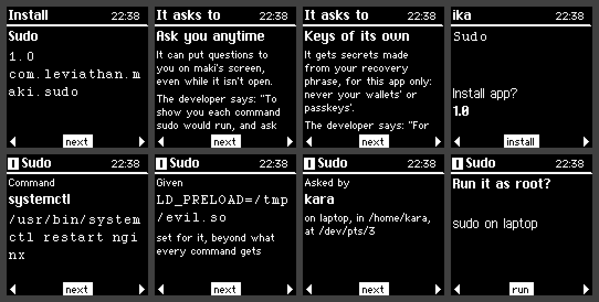

# sudo, with a yes on maki

With the Sudo app on maki and its plugin set up, every command sudo would run waits for your yes on
maki, which shows it whole. It's a second factor for root that shows you what you're approving:
malware that has your password, or sudo's remembered one (the five minutes after you last typed it),
still can't run anything as root through sudo without you.

## What maki shows

Once sudoers has said yes to a command, maki desktop's plugin asks maki, and maki shows:

- **The command** whole: its full path and arguments, quoted as a shell would take them back, so a
  space or a quote can't hide anything. Bytes that aren't printable are shown as escapes.
- **What it's given to run with**, beyond what every command gets: an `LD_PRELOAD` set on the
  command line (sudoers lets `ALL` do that), a PATH that looks anywhere but the system's own places,
  or anything else a program might take a hint from.
- **Who asked, where:** the user, the computer's name, the directory, the terminal; the group it
  runs with and a chroot, if either.
- For **sudoedit**, the files to be edited.

Then **Run it as root?** (or as whoever it runs as). A yes runs it; a no, or no answer within a
minute, doesn't. What maki can't show whole, it turns down without asking.

## Why malware can't say yes for maki

maki's yes is a signature: the Sudo app signs the request (a fresh nonce from the plugin, and
everything maki showed) with a key of its own from your recovery phrase. The plugin checks it
against the key set up in `/etc/maki/sudo.pub`, which only root can change. Software on your
computer can't make that signature, can't reuse an old one, and can't stand in for maki desktop:
the plugin talks only to a socket of yours with a process of yours at the other end, and trusts
nothing it says but the signature.

## Setting it up

Linux, with sudo 1.9 or later (the approval plugins it runs after sudoers):

- Install the **Sudo** app on maki from the store.
- In maki desktop, **sudo & Confirm**, **sudo**: compare the key it shows with the one maki's Sudo
  app shows from its menu, then **Turn on**. It asks for your admin password.

Setting up puts the plugin in `/usr/local/libexec/maki`, maki's key in `/etc/maki/sudo.pub` (root's)
and a line in `/etc/sudo.conf` for your user; then it starts sudo once, and if sudo won't start with
the plugin, everything goes back as it was. **Turn off** takes it all away again.

## Keep another way in

With no maki to ask (it's unplugged, or maki desktop isn't running), sudo runs nothing, for you.
If maki is lost, you'll need another way to root to turn it off: `su` with root's password, or
pkexec, which asks for your password and doesn't ask maki. Make sure you have one before you turn
it on.

That also means maki guards sudo, not every way to root: pkexec and su still take a password
alone. Other users' commands, and root's own, go ahead on sudoers' say, as before.

## Checked how

The plugin (Rust, `sudo/` in maki-desktop) is tested through a harness that calls it as sudo does,
against the Sudo app on the stand-in for maki, and with the real sudo, as root in a Fedora
container: set up, commands approved, refused and unanswered, an `LD_PRELOAD` shown, a key file
someone else could change refused, an impostor's signature refused, and turned off.
