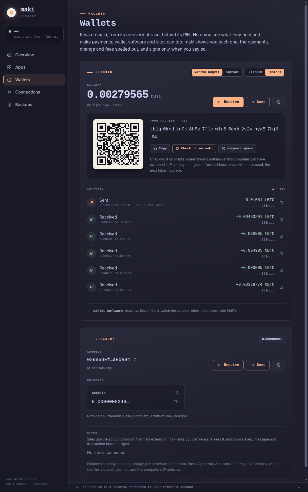
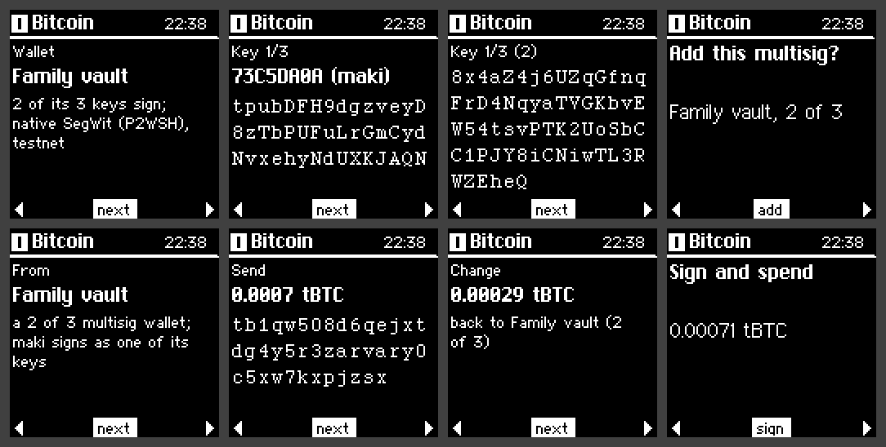

# Wallets

maki's wallets are apps from the store, for those who want them: **Bitcoin**, **Litecoin**,
**Dogecoin**, **Bitcoin Cash**, **Kaspa**, **Ethereum**, **Monero**, **Solana**, **XRP**,
**Stellar**, **Tron**, **Cosmos**, **NEAR**, **Sui**, **Aptos** and **Cardano**. maki keeps the
keys, made from your recovery phrase at the standard paths other wallets use, so the same phrase
works in Sparrow, MetaMask, Phantom, Keplr, Eternl or a Ledger too. Each app may use only the
accounts its manifest names, which maki shows you when you install it.

Every payment is shown on maki's screen before it's signed: each one's amount and full address, the
change coming back, and the fee, a page at a time. maki signs only when you say yes there, and only
as many signatures as that yes allowed.

Keep the wallets to pocket money. maki protects keys from your computer, not from someone holding
the badge (see [the security model](security.md)).

## What maki checks

A computer that lies can't get a signature you didn't mean to give:

- **Every input is maki's own.** A Bitcoin transaction's inputs must derive from maki's keys, and
  each must come with the whole transaction it spends, whose hash must match: amounts are never
  taken on the computer's word (the 2020 SegWit fee attack).
- **Change is only change** if it pays maki's own change chain; anything else is shown as a payment,
  with its full address.
- **The fee is what goes in minus what comes out**, and a fee over a tenth of what's sent is
  called out.
- **Only ordinary signatures**: SIGHASH_ALL on Bitcoin, and nothing an app can't show you in full.

## Bitcoin

Two accounts, the standard ones: native SegWit (BIP84, `m/84'/0'/0'`) and taproot (BIP86,
`m/86'/0'/0'`), on bitcoin and the test networks.

### In maki desktop

**Wallets**, **Bitcoin**, **Add from maki**: maki asks before sharing the account's public key
(which shows every address it will ever have, but can't spend). maki desktop then shows the
balance and activity (from mempool.space), gives you fresh addresses to check on maki's screen, and
sends at the fee you pick; a payment stuck waiting can be sped up.

### With Sparrow or Bitcoin Core

maki works with wallet software as a watch-only wallet that maki signs for:

- **Watch the account.** In maki desktop's **Wallet software** section, copy the account's
  descriptor (`wpkh([73c5da0a/84h/0h/0h]xpub…/<0;1>/*)`) and import it into Sparrow or Bitcoin
  Core. Or scan it: the Bitcoin app's menu shows it as a QR code.
- **Check an address** on maki's screen before you give it out: **Show on maki**.
- **Sign a transaction:** save it as a PSBT in your wallet software, open it (or paste it) in maki
  desktop, go through it on maki, and give the signed PSBT back to your wallet software to broadcast.

### With no cable

The Bitcoin app signs with no cable at all. Show the PSBT as a QR code in Sparrow (it animates, a
part at a time); on maki, open the Bitcoin app, menu, **Sign from a QR code**, and point maki's
camera at it. maki goes through it, then shows the signed PSBT back the same way for Sparrow to
scan.

### Multisig

maki can be one of the keys of a multisig wallet (native SegWit, P2WSH, up to fifteen keys), with
Sparrow, Nunchuk, Specter or Bitcoin Core as the coordinator. maki signs for a wallet only once
you've added it on maki, going through every key; after that, a computer can't swap a key or pass
off change to a wallet it controls.

- **Give the coordinator maki's key.** maki desktop, **Wallets**, **Bitcoin**, **Multisig**:
  **Share it from maki**, then **Save for Sparrow…** (the file Coldcard exports a key in, which
  Sparrow imports as an airgapped hardware wallet), or copy it:
  `[73c5da0a/48h/0h/0h/2h]Zpub…`. The Bitcoin app's menu also shows it as a QR code.
- **Make the wallet** in the coordinator with maki's key among the others.
- **Give maki the wallet:** export it from the coordinator (Sparrow's Coldcard multisig file, or
  its output descriptor), then in maki desktop **Open file…** or paste it, and **Add on maki**.
  Or read it off the coordinator's screen: the Bitcoin app's menu, **Add a multisig**. maki shows
  the wallet, then every key's fingerprint and xpub, its own marked: compare them with the
  coordinator's before you say yes.
- **Spend** as with any PSBT. maki shows which wallet it's from first, then each payment, the change
  "back to" the wallet and the fee, and adds its signature beside the others'. The coordinator puts
  the signatures together and broadcasts.

maki checks each input's script against the wallet as you added it, rebuilt from its keys, never
against what the PSBT claims; change counts as change only if it pays the wallet's own change chain.

## Ethereum

One account, the standard one (`m/44'/60'/0'/0/0`, as MetaMask and Ledger make it).

- **Sites** use it through the [browser extension](extension.md): a site connects only when you
  allow it on maki. Messages, typed data (EIP-712, with permits spelled out: who may spend how much
  of which token, until when) and transactions are shown on maki and signed there; token transfers
  and approvals are spelled out, and any other call flagged as unreadable.
- **maki desktop** holds the account on six networks (Ethereum, Base, Optimism, Arbitrum, Polygon and
  Sepolia): what it holds, tokens included, and sending a coin or a token to an address or an ENS
  name, whose address maki shows.
- **MetaMask by QR code** (Keystone's protocol): the Ethereum app shows the account as a QR code for
  MetaMask to add, reads MetaMask's requests off its screen, and answers with the signature as a
  QR code.

## Monero

The wallet a Ledger makes from the same phrase: its address and subaddresses as QR codes on maki.

- **The 25-word backup** that restores it in any Monero wallet: the Monero app's menu shows it on
  maki's own screens, after you say you want it. The words never reach the app or the computer.
- **Watching:** maki shares the view key once you say so, so maki desktop can find your coins; it
  scans the chain itself, from a node you pick, which never sees the key. It can't spend.
- **Spending:** maki makes and signs each transaction whole, after you've gone through every
  payment, the change and the fee. It takes maki a while (tens of seconds for a small one).
- **The Monero GUI** (or monero-wallet-cli) can keep a view-only wallet made from the address and
  view key, with maki as its cold wallet, through the files its Advanced options pass back and
  forth: maki makes key images for its outputs, so it sees what's spent, and signs each
  transaction the GUI makes.

## Solana

The account Phantom and Solflare make from the same phrase (`m/44'/501'/0'/0'`).

- **Sites** see a wallet called maki, registered the Wallet Standard's way, and connect once you
  allow it on maki. Each transaction (legacy or version 0) and message is read as Solana's runtime
  reads it and shown on maki: SOL and tokens sent spelled out, a token's recipient as their own
  address when the transaction proves the token account is theirs, the most the fee can be, and
  anything maki can't read flagged.
- **maki desktop** holds the account on Solana and its devnet: its SOL and tokens, and sending,
  simulated first, then signed on maki.

## Litecoin, Dogecoin and Bitcoin Cash

Bitcoin's own wallet code, on each one's network: everything maki checks for Bitcoin, it checks
for these.

- **Litecoin:** native SegWit (`m/84'/2'/0'`) and taproot (`m/86'/2'/0'`), as Litecoin Core,
  Electrum-LTC and Ledger make them. maki desktop holds it through litecoinspace.org.
- **Dogecoin:** the account Trezor, Ledger and the other BIP44 wallets make (`m/44'/3'/0'`,
  addresses starting with D); every coin it spends comes with the whole transaction that made it.
  maki desktop has no public Dogecoin server to ask yet.
- **Bitcoin Cash:** the account Electron Cash and Ledger make (`m/44'/145'/0'`), its addresses in
  CashAddr (`bitcoincash:q…`), signed with Bitcoin Cash's fork ID. maki won't spend or make
  CashTokens, which it can't show. maki desktop goes through Bitcoin Cash's Electrum servers.

## Kaspa

The account Kaspium, Kaspa NG, Kastle and Ledger's Kaspa app make (`m/44'/111111'/0'`). maki desktop
finds the addresses it has used, receiving and change, and sends from them through api.kaspa.org,
the change to a fresh change address, paying Kaspa's fee for the payment's mass.

A Kaspa signature covers only its own coin's amount, so a computer could lie about one coin and
then another for the same payment (the SegWit fee attack of 2020): maki keeps what it was told
each coin it signed for held, and refuses one said to hold something else. Kaspa charges for small
outputs to keep them: a payment of less than about 0.2 KAS costs more than it's worth, or won't go.

## XRP, Stellar and Tron

- **XRP:** the account Xaman, Ledger and Trust Wallet make (`m/44'/144'/0'/0/0`): XRP, RLUSD and
  USDC. A partial payment, handing the account to another key, and a fee over 2 XRP are said
  loudly, and a token whose code spells XRP is never shown as XRP. maki desktop takes a
  destination tag.
- **Stellar:** the account Freighter and Ledger make (SEP-5's, `m/44'/148'/0'`): XLM, USDC and EURC
  (Circle's, by their issuer). Anything that changes who can sign for the account is said loudly.
  maki desktop takes a memo, and opens a new account with the 1 XLM Stellar needs.
- **Tron:** the account TronLink and Ledger make (`m/44'/195'/0'/0/0`): TRX, USDT and the other
  tokens maki knows, the most a token payment can burn for energy shown. Tron's accounts are sent
  tokens unasked, often scams named like real ones: maki desktop counts those, and doesn't show them.

## Cosmos

The account Keplr, Cosmostation and Ledger make (`m/44'/118'/0'/0/0`), on the Cosmos Hub and the
chains that share its keys: Osmosis, Celestia, Noble (its USDC), dYdX, Neutron, Akash, Axelar,
Babylon and Juno. maki desktop's Cosmos card has a chain picker, and maki shares the account on each
chain you pick. maki reads sends, staking, votes and IBC transfers in full, and refuses grants that
would let another account act for yours, Cosmos's usual phishing.

## NEAR, Sui and Aptos

- **NEAR:** the implicit account MyNearWallet, near-cli and Trust Wallet make (`m/44'/397'/0'`):
  NEAR, USDC, USDT and wNEAR. When the recipient isn't signed up for a token yet, maki desktop pays
  its deposit for them in the same transaction, and says so.
- **Sui:** the account Slush and Ledger make (`m/44'/784'/0'/0'/0'`): SUI, USDC and the other coins
  maki knows, in coin objects or in the account's address balance. A call maki can't read is
  flagged with what it's given, and sponsored transactions aren't signed.
- **Aptos:** the account Petra and Ledger make (`m/44'/637'/0'/0'/0'`): APT, USDC and USDT, each
  payment's gas found by trying it first. Nothing that would hand the account to another key is
  signed.

## Cardano

The account Eternl, Lace, Yoroi and Ledger make (`m/1852'/1815'/0'`), with Cardano's own kind of
keys (BIP32-Ed25519, which maki makes from your phrase as they do): ADA and its tokens. maki desktop
works out the account's addresses itself and goes through Koios; maki checks that change pays the
account's own address with its own stake key, and signs nothing for scripts, pools or governance
actions.

